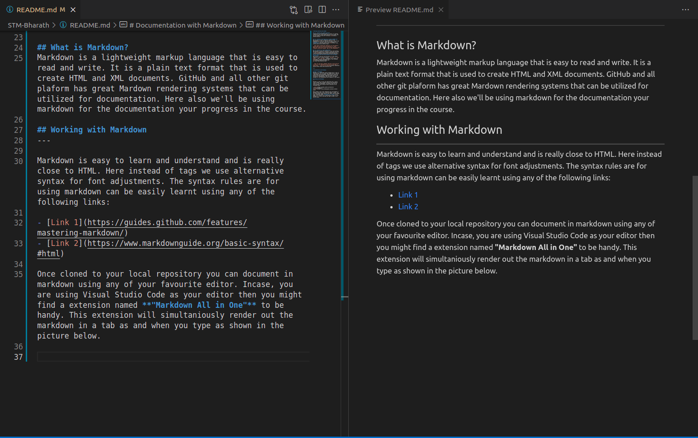

# Getting Started with GitHub

## **1. Creating Your GiHub Account**
Creating your own GitHub Account is similar to creating acoounts on most social media websites we see today. You can join GIHub by using the following [link](https://github.com/join).


## **2. Creating a New Repository & adding README.md**
Now we have to create a repository where all the documentation of all your work will be done. The detailed guidelines in creating a repository and adding the **README.md** file are given in the [link](https://help.github.com/articles/create-a-repo/).

```Note: While creating the repository for the program's purpose make sure you name the repository in "<Your Name>_STP" format and it must be a private repository with "Synopsys University Program - MEC" as the collaborator.```

## **3. Cloning to a local repository**
Now we have to clone the repository to our local machine. The detailed guidelines in cloning a repository are given in the [link](https://docs.github.com/en/repositories/creating-and-managing-repositories/cloning-a-repository).
## **4. Saving your work and pushing it to the remote repository**
Now we have to save our work and push it to the remote repository. This is done using the ```git add``` , ```git commit``` and ```git push``` commands. All of which are explained in the git cheatsheet given in the following [link](https://education.github.com/git-cheat-sheet-education.pdf).


```Note: All the basic commands required to work with git is given in the cheatsheet and the link to the same is given below.``` [Link to the cheatsheet](https://education.github.com/git-cheat-sheet-education.pdf)

<br>

# Documentation with Markdown

## What is Markdown?
Markdown is a lightweight markup language that is easy to read and write. It is a plain text format that is used to create HTML and XML documents. GitHub and all other git plaform has great Mardown rendering systems that can be utilized for documentation. Here also we'll be using markdown for the documentation your progress in the course.

## Working with Markdown
---

Markdown is easy to learn and understand and is really close to HTML. Here instead of tags we use alternative syntax for font adjustments. The syntax rules are for using markdown can be easily learnt using any of the following links:

- [Link 1](https://guides.github.com/features/mastering-markdown/)
- [Link 2](https://www.markdownguide.org/basic-syntax/#html)

Once cloned to your local repository you can document in markdown using any of your favourite editor. Incase, you are using Visual Studio Code as your editor then you might find a extension named **"Markdown All in One"** to be handy. This extension will simultaniously render out the markdown in a tab as and when you type as shown in the picture below. 

